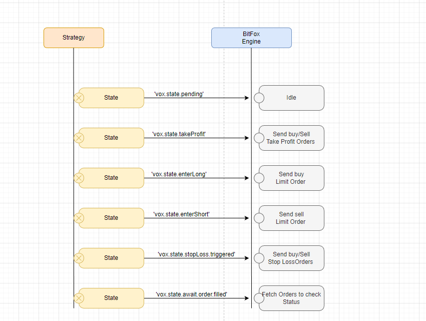

## Creating Strategies

### Understanding States

Before implementing a new Strategy its good to familiarise yourself with the
BitFox states that can be used inside your Strategy to toggle logic based on states!

States are available in your Strategy if you have properly implemented your Strategy by ensuring your Strategy class extends the ``Strategy`` base class!
States are returned to the BitFox engine instance with each execution and help the Engine to identify what actions it should take.

The Diagram below shows what ``action`` the engine takes when it receives a certain state!



Have look at below available states most of them are pretty self-explanatory

```js
// The initial State of all Strategies
static STATE_PENDING ='state.pending';

// A state that signals it is time to take profit 
static STATE_TAKE_PROFIT ='state.takeProfit';

// A state that signals the Strategy has determined a Long Entry 
static STATE_ENTER_LONG ='state.enterLong';

// A state that signals the Strategy has determined a Short Entry
static STATE_ENTER_SHORT ='state.enterShort';

// Moving Average specific state, can be useful if you like to wait for a crossing up of different moving averages
static STATE_AWAIT_CROSS_UP ='state.awaitCross.up';

// Moving Average specific state, can be useful if you like to wait for a crossing down of different moving averages
static STATE_AWAIT_CROSS_DOWN ='state.awaitCross.down';

// A state that signals we are in a idle phase and wait for a take profit signal
static STATE_AWAIT_TAKE_PROFIT ='state.awaitTakeProfit';

// A state that signals the Stop Loss target has reached and a stopp loss order should be made
static STATE_STOP_LOSS_TRIGGERED ='state.stopLoss.triggered';

// A state that signals that we are waiting for a Limit Order to be filled
static STATE_AWAIT_ORDER_FILLED ='state.await.order.filled';

// A Strategy specific state, can be useful if you like to wait for a dedicated confirmation logic to resolve to true
static STATE_AWAIT_CONFIRMATION = 'state.await.confirmation';

// A Strategy specific state, signalling that the current trend is up, this could be handy if you want to identify and keep track of a current price trend
static STATE_TREND_UP = 'state.trend.up';

// A Strategy specific state, signalling that the current trend is down, this could be handy if you want to identify and keep track of a current price trend
static STATE_TREND_DOWN = 'state.trend.down';

// A state that signals to the engine to trigger an alert!
static STATE_TRIGGER_ALERT = 'state.trigger.alert';

// A Engine specific state, signalling to the engine that the current Strategy is a independent Strategy i.e. Trades and Orders managed from within the Strategy and Engine should not react to State Changes,  
static STATE_CONTEXT_INDEPENDENT = 'state.context.independent';

```

### Understanding Indicators

Every Custom Strategy when implemented properly and extends BitFox Base Strategy has
through class Hierarchy access to the internal Indicator classes.

Indicator classes provide 2 static interfaces

1. ``.className`` which returns a String value of the target Indicator Class
2. ``.getData()`` This method parses candle data and returns the indicator Data

You don't need to worry about the second interface as this method is used internally,
by the Base Strategy instance, which is handling the creation of indicator data for you.

But it is important to understand how Indicator data inside your Strategies is initialized.

```js
async setup(ohlcvCandles){
    this.setIndicator(clineCandles,{multiplier:this.args.multiplier || 3,period:this.args.period || 7},this.indicators.SuperTrendIndicator.className);
        return this;
}
```
The Above method is a method that must be implemented in all Custom Strategies,

Its very simple we provide a buffer or array of (open,closes,low's,highs and volume) values,
and create our Indicator data from it.

You might have noticed that a method from the Base Class is invoked.
This method is responsible to identify the Indicator, we tell the Base class what Indicator we want to use by using this peace of
code ``this.indicators.SuperTrendIndicator.className;``

We provide a wide and growing range of Indicators it is recommended to look at the Documentation provided
in the Indicator class instances to understand what structure and values to expect from the return values of these Indicators

On any good IDE these days, you could just try ``this.indicators.`` and wait for auto-completion,
this should show you a list of available indicators but also their documentation and usage.

Below you can find the list of exportable Indicators

```js
this.indicators.FloorPivots.className;
this.indicators.Woodies.className;
this.indicators.SmaIndicator.className;
this.indicators.SuperTrendIndicator.className;
this.indicators.RsiIndicator.className;
this.indicators.AtrIndicator.className;
this.indicators.BollingerIndicator.className;
this.indicators.MacdIndicator.className;
this.indicators.PatternRecognitionIndicator.className;
this.indicators.WilliamsRIndicator.className;
this.indicators.KsiIndicator.className;
this.indicators.MfiIndicator.className;
this.indicators.ObvIndicator.className;
this.indicators.Ema4Indicator.className;
this.indicators.Ema3Indicator.className;
this.indicators.Ema10And20.className;
this.indicators.Sma3Indicator.className;
this.indicators.AdlIndicator.className;
this.indicators.AdxIndicator.className;
this.indicators.AwesomeOscillatorIndicator.className;
this.indicators.CciIndicator.className;
this.indicators.StochasticIndicator.className;
this.indicators.IchimokuCloudIndicator.className;
this.indicators.WildersSmoothingWeighteMovingAvg.className;
this.indicators.WeighteMovingAvg.className;
this.indicators.VolumeProfile.className;
this.indicators.VolumeWeightedAvgPrice.className;
this.indicators.TrixIndicator.className;
this.indicators.ForceIndexIndiactor.className;
this.indicators.RocIndicator.className;,
this.indicators.PsarIndicator.className;
this.indicators.IndicatorUtils.className;
this.indicators.EMAIndicator.className;
this.indicators.IndicatorList.className;
```

### A Strategy Template
We know .... its exciting to get Started right away and start creating you Strategies, but before you start Hacking away please take a few minutes
to read carefully through the below Strategy Template or boilerplate Code...

**We Strongly recommend that you create your own Strategies based on this template**

```js
// import bit fox 
let bitfox = require("bitfox").bitfox;

// retrieve the Base Class instance 
let BaseStrategy = bitfox.Strategy;
let utils = bitfox.utils;

class StrategyTemplate extends BaseStrategy {
    static init(args){
        return new StrategyTemplate( args);
    }
    
    // args here is an object and should follow this structure 
    /* {extra:{}, sidePreference:"long|short|bidirectional" } */
    
    // @extra this is a object soletargeted at your strategy lets say you don't want to use a default period for an RSI indicator you 
    //        would add an extra object like this {period:14}
    
    // @sidePreference this is a Strategy specific parameter, its optional and defaults to biDrectional
    //                You could use in the STrategy to ensure only long|short or biredirectional entries/exits are signalled 
    constructor(args) {
        super(args);
        // You Don't need this but you can instiantiate a event Handler and Emitter We will cover how to use it later in this document
        // Whenwe create our first Simple Strategy. 
        this.eventHandler = null;
    }

    
    // Getter and Setter for the Strategies State object 
    setState(state){ this.state = state; }
    getState(){ return this.state}

    // ALWAYS implement this it makes things very easy and helps you focus on whats important.. 
    // your Strategy Logic.. ah it goes without saying tight? swap YOUR_INDICATOR with the indicator tyou like to use.
    
    async setup(klineCandles){
        this.setIndicator(clineCandles,{},this.indicators.YOUR_INDICATOR.className);
        this.YOUR_INDICATOR = this.getIndicator()

        // You Can Instantiate more than one Indicator
        this.setIndicator(clineCandles,{},this.indicators.YOUR_INDICATOR.className);
        this.YOUR_SECOND_INDICATOR = this.getIndicator()
        
        
        
        /***
         * PLEASE READ THIS Carefully!!!!!
         * 
         * Sometimes you don't just want to use one Indicator right? 
         * Maybe you want to use 2,3,4 Indicators?
         * This is no problem but... there is currently a small limitation! 
         * 
         * Lets say you have a RSI Indicator with a period of 14 and also want a SimpleMovingAverage Indicator
         * with a period of 200. 
         * 
         * In this case you MUST  ensure thet the Indicator with the longest period is initialized last
         * 
         *         this.setIndicator(clineCandles,{period:14},this.indicators.RSI.className);
         *         this.RSI = this.getIndicator()
                   this.setIndicator(clineCandles,{period:200},this.indicators.SmaIndicator.className);
                   this.SMA = this.getIndicator()
         
         * The Limitation is inside our engine because it needs to recalculate and adjust actual Candles Array Size against Indicator Data Arrays
         * So the engine will recalculate and Adjust array data from the last initialized Indicator inside your Strategy
         * So The indicators that require longest periods need to be initialized last!
         */
        return this;
    }

    /**
     * 
     * @param event
     * @param data
     * 
     * This is a custom Event Handler that you may want to leverage when a certain condition is triggered 
     * lets say a long entry is signalled inside your strategy you could implement a eventemitter like this:
     *
     * this.fireEvent("myCustomEvent",{"myField":"YourFiled", state:this.getStrategyResult()})
     */
    fireEvent(event,data){
        this.eventHandler?.fireEvent(event,data);
    }

    /***
     * 
     * @returns {Indicator.Obj}
     */
    getIndicator(){return super.getIndicator()}

    /***
     * 
     * @param _index
     * @param isBackTest
     * @returns {Promise<void>}
     * 
     * This is the Heart and Soul of your Strategy. 
     * 
     */
    
    // @_index       The _index parameter is really only used when you are backtesting the strategy
    //               It is the index of the current candle Data and the corresponding Indicator index
                     
    // @isBackTest   This is a boolean that is injected/provided by the engine instance and provided at
    //               engine instiantiation.
    // @ticker optional but the engine will provide a last ticker value 

    async run(_index=0, isBackTest=false, ticker=null){
        // You don't really need to change this if unless you have something else in mind
        // All we do here is to check if the Strategy is in in a enter long or short state, if it is the calling engine
        // or backtesting engine would have reacted and created respective real or mocked orders.
        if(this.state === this.states.STATE_ENTER_LONG || this.state === this.states.STATE_ENTER_SHORT){
            this.state = this.states.STATE_AWAIT_ORDER_FILLED;
            return this.getStrategyResult(this.state, {});
        }if(this.state === this.states.STATE_PENDING){
            
            // This is a call to the Super clas that has your last Instantiated Indicator Data cached
            // If you have Initialized multiple local indicators you don't need to call it as they would be
            // allready available in your Strategy 
            let data = this.getIndicator();
          
            /**
             *  This is how you can access the indicator data
             * 
             *  If it is a backTest we use the index as given from the Engine (The Engine is iterating over a Data Set of Candles)
             *  If it is not a backtesting scenarionwe access the last (most recent) value in the indicator array.
             *  
             * */
            let currentIndicatorDataOne = this.YOUR_INDICATOR[isBackTest ? _index : data.length - 1]
            let currentIndicatorDataTwo = this.YOUR_SECOND_INDICATOR[isBackTest ? _index : data.length - 1]

            // This is same as above but this time we calling a method in the super class to provide the current approximate price
            let currentPrice = this.getApproximateCurrentPrice(isBackTest,_index);
            
            // This where it is all up to you create a function and process the Indicator data to
            // Determine if your Strategy signals long|short|stop signals
            let {enterLong,enterShort, triggerStop} = yourAwesomImplementation(currentPrice,currentIndicatorDataOne,currentIndicatorDataTwo)
            
            // This is the most important Logical Block in the Strategy here we are determining and toggling states
            // that returned to the Engine which in turn will react to States returned
            if(enterShort){
                if(this.sidePreference === 'short' || (this.sidePreference === 'biDirectional')){
                    this.state = this.states.STATE_ENTER_SHORT;
                }
            }
            if(enterLong){
                if(this.sidePreference === 'long' || (this.sidePreference === 'biDirectional')){
                    this.state = this.states.STATE_ENTER_LONG;
                }
            }
            return this.getStrategyResult(this.state,{value:data[isBackTest ? _index : data.length - 1].value});
        }
        return this.getStrategyResult(this.state,{});
    }
}

// Optional export of ths class
module.exports = {StrategyTemplate:StrategyTemplate}
```
